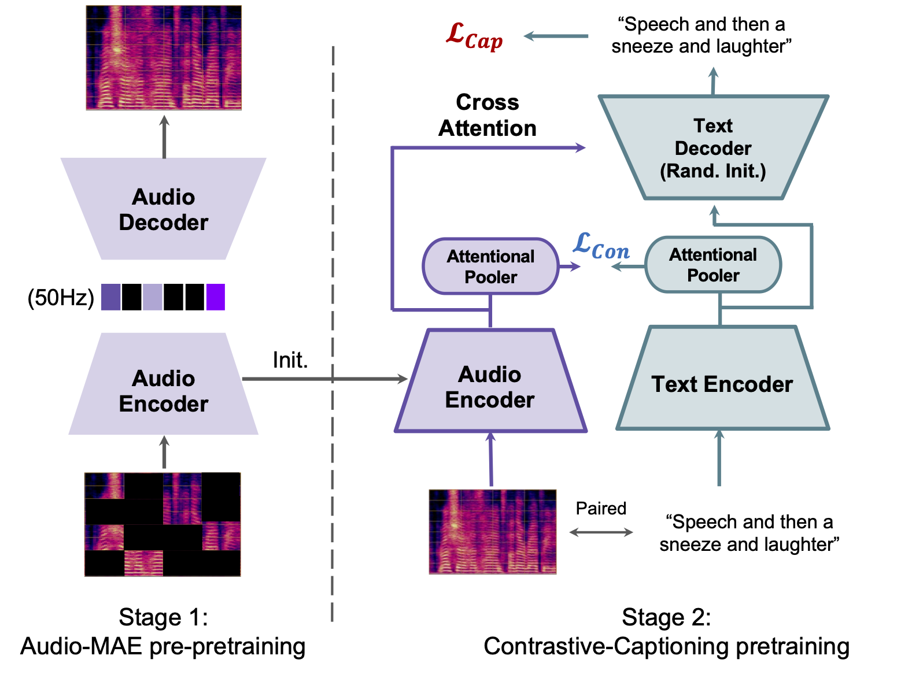

# Cacophony
Inference codebase for "Cacophony: An Improved Contrastive Audio-Text Model"

## Abstract
Despite recent advancements in audio-text modeling, audio-text contrastive models still lag behind their image-text counterparts in scale and performance. We propose a method to improve both the scale and the training of audio-text contrastive models. Specifically, we craft a large-scale audio-text dataset containing 13,000 hours of text-labeled audio, using pretrained language models to process noisy text descriptions and automatic captioning to obtain text descriptions for unlabeled audio samples. We first train on audio-only data with a masked autoencoder (MAE) objective, which allows us to benefit from the scalability of unlabeled audio datasets. We then, initializing our audio encoder from the MAE model, train a contrastive model with an auxiliary captioning objective. Our final model, which we name Cacophony, achieves state-of-the-art performance on audio-text retrieval tasks, and exhibits competitive results on the HEAR benchmark and other downstream tasks such as zero-shot classification. 

<br>
<p align="center">
    
</p>
<br>

## Acknowledgement

```
@ARTICLE{zhu2024cacophony,
  author={Zhu, Ge and Darefsky, Jordan and Duan, Zhiyao},
  journal={IEEE/ACM Transactions on Audio, Speech, and Language Processing}, 
  title={Cacophony: An Improved Contrastive Audio-Text Model}, 
  year={2024},
  volume={32},
  pages={4867-4879},
  doi={10.1109/TASLP.2024.3485170}}
```

## Requirements
Jax and Flax are used for the model implementation. Tested on RTX 2080Ti, CUDA version 11.5, cuDNN version 8.2.1, cudatoolkit 11.3.1, and Python 3.8.17.

```bash
pip install requirements.txt
```

## Pretrained Models
We provide the following pretrained models on both stages of the Cacophony model, folder [here](https://drive.google.com/drive/folders/1lZHJuClyn4FK_Fhn92ylQqyAd40uJv0Y?usp=sharing).
### Stage 1: AudioMAE
Model detail: 
* Filename: AudioMAE.ckpt
* Audio sampling rate: 16000
* Audio Encoder: 85.26M
* Audio Decoder: 85.85M
* File MD5: 3a8a7778a5e2013ceb4a418e1504d3d8

### Stage 2: Cacophony
 Model detail:
* Filename: Cacophony.ckpt
* Audio sampling rate: 16000
* Audio Encoder size: 85.26M
* Text Encoder size: 125.23M
* Text Decoder size: 76.46M
* File MD5: bb6aa4b4e8e90ea3595021bf8233add0

## Evaluation Results

To be updated with torch model weights, results on jax model weights can be found [here](./src/eval/EVAL.md).

## Acknowledgements

We are immensely grateful to the Google TPU Research Cloud (TRC) for generously providing the computational resources vital to our project. 
Their support has been invaluable.


We thank the FreeSound team from Pompeu Fabra University for providing us with the scraping API.
We thank the University of Rochester Goergen Institute for Data Science (GIDS) seed funding program.
We thank LAION CLAP team for collecting open source datesets and generously sharing them with the research community.

